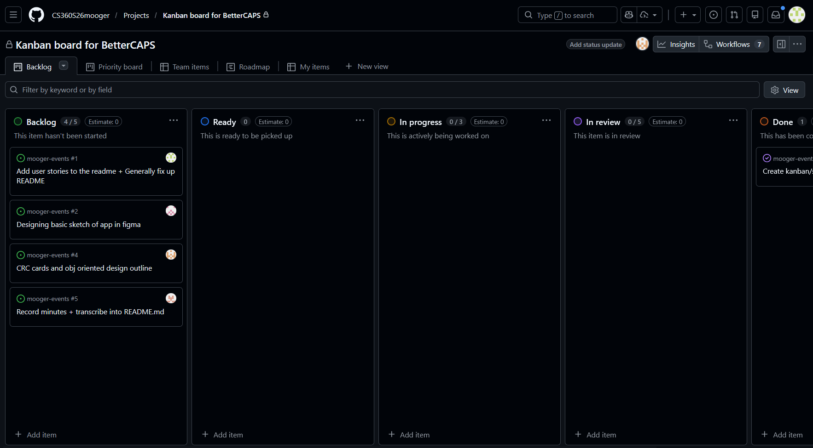
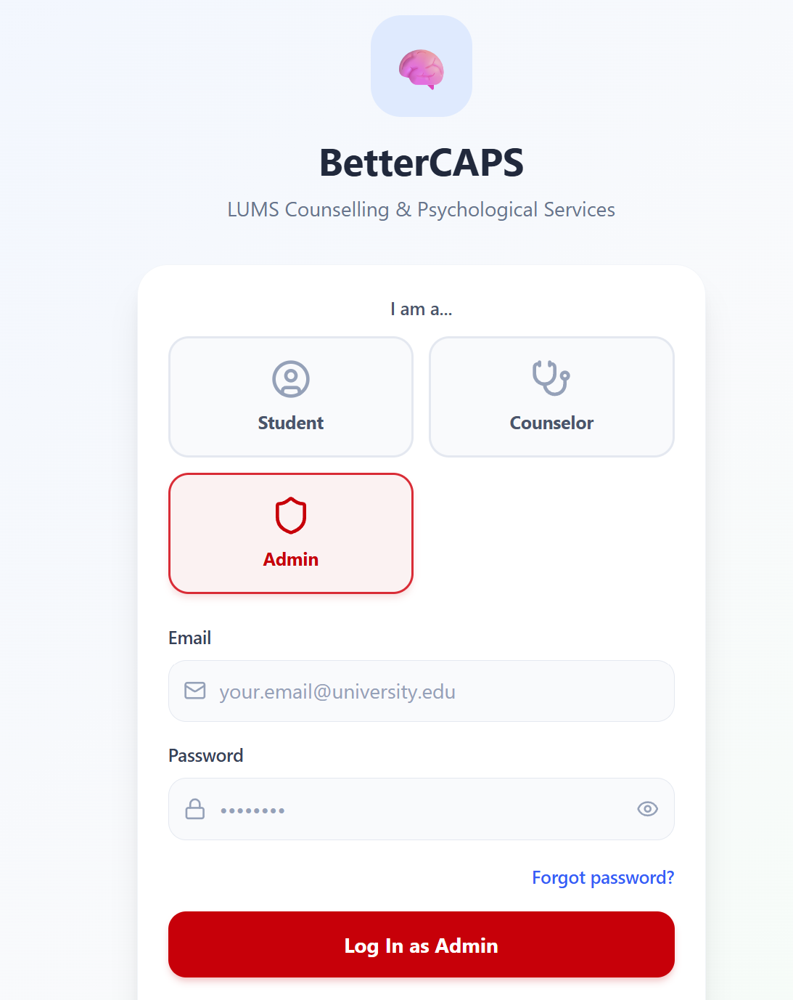
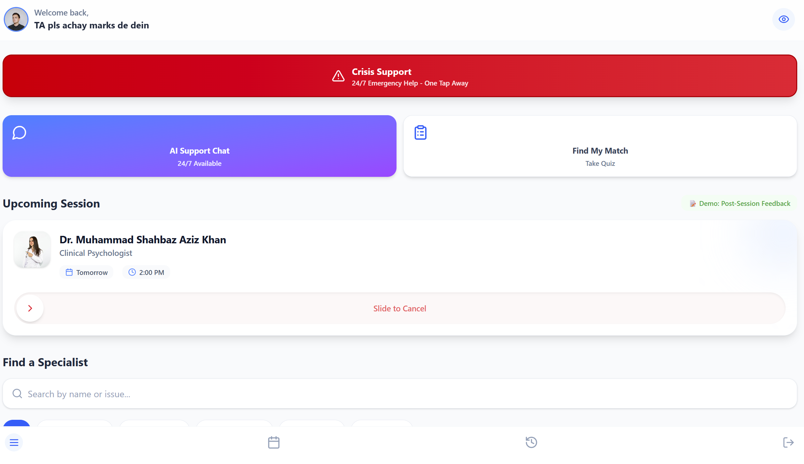
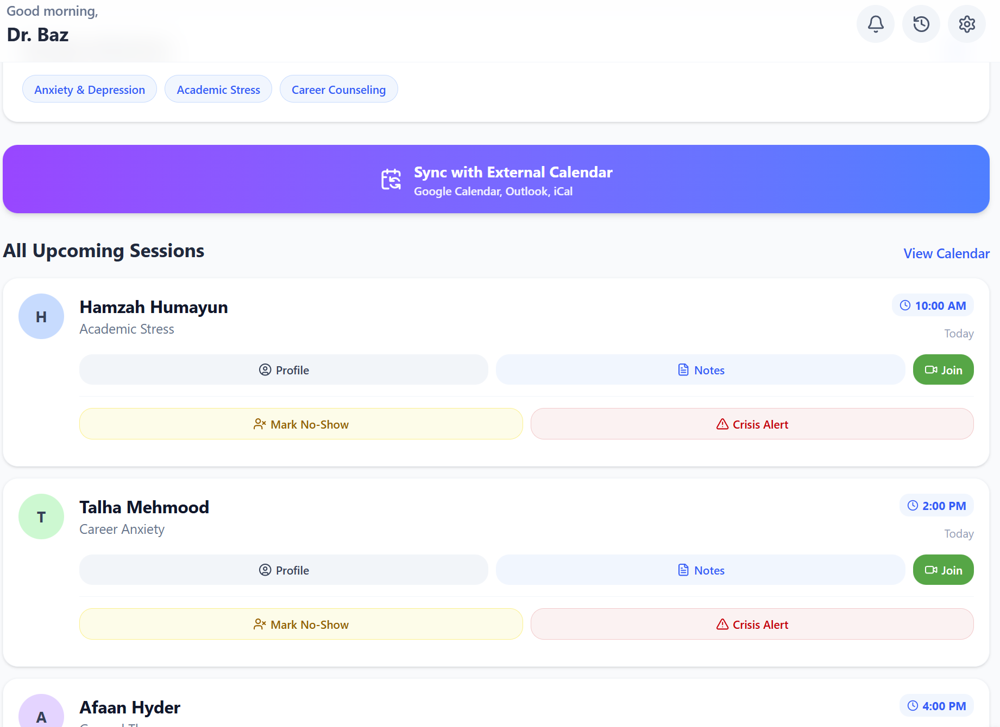
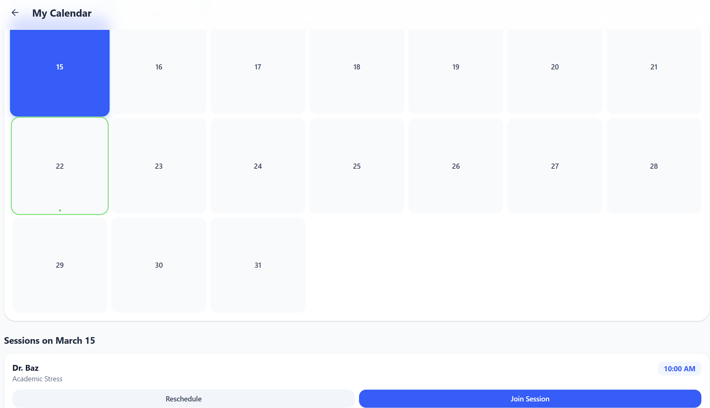
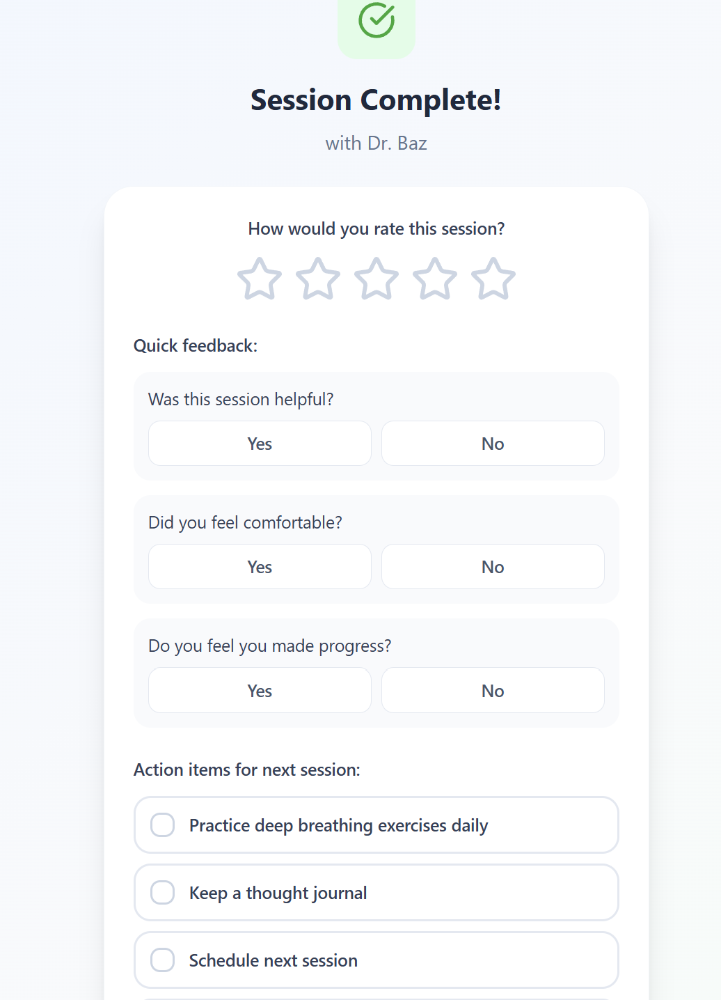
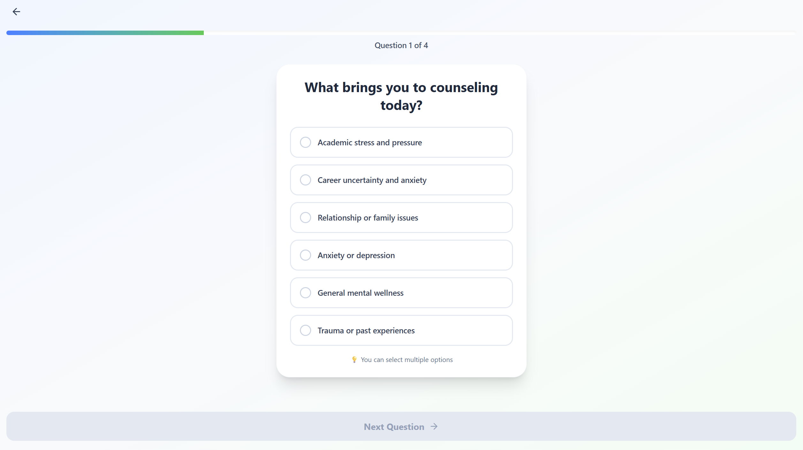

# Project Documentation

## Table of Contents
- [Team Information](#team-information)
- [Meeting Minutes](#meeting-minutes)
  - [Meeting – Feb 20, 2026](#meeting--feb-20-2026)
  - [Meeting – March 2, 2026](#meeting--march-2-2026)
- [Product Backlog](#product-backlog)
  - [Kanban Board Snapshots](#kanban-board-snapshots)
  - [Product Backlog – Project Part 1](#product-backlog--project-part-1)
  - [Product Backlog – Project Part 2](#product-backlog--project-part-2)
- [Object-Oriented Analysis (CRC Cards)](#object-oriented-analysis-crc-cards)
- [User Interface Mockups & Wireframes](#user-interface-mockups--wireframes)
  - [Figma Workspace](#figma-workspace)
  - [UI Screens & Storyboards – Project Part 2](#ui-screens--storyboards--project-part-2)
- [UML Diagrams](#uml-diagrams)

---

## Team Information
- **Team Name:** mooger

| Name                             | Roll Number | GitHub ID       |
|----------------------------------|-------------|-----------------|
| Muhammad Shahbaz Aziz Khan       | 27100049    | ShahbazAzizK    |
| Mujeeb Asad                      | 271000095   | mujeeb-asad     |
| Hannan Mustafa                   | 21700330    | hannanmustafa08 |
| Muhammad Hasan Musa Gondal       | 27100456    | Musa-Gondal     |
| Muhammad Ibrahim                 | 27100119    | not-ibrahim     |

---

## Meeting Minutes
**Duration:** 6 minutes

### Meeting – Feb 20, 2026

#### Date
20th February 2026

**Attendance:**
- Muhammad Ibrahim (27100119)
- Muhammad Shahbaz Aziz Khan (27100049)
- Muhammad Hassan Musa Gondal (27100456)
- Hannan Mustafa (27100330)
- Mujeeb Asad (27100095)
---
#### Key Takeaways
- Established the Wiki structure for the new repository.
- Reviewed the sample project backlog to prepare for upcoming tasks.
- Initiated front-end planning and familiarization with the shared wireframes and storyboards.
- Confirmed the final due date for the upcoming deliverables.
---

#### Prepared Questions & Decisions

**Deliverables & Deadlines**
- What are the required deliverables? → Confirmed expected deliverables
- What is the exact due date for the deliverables? → Confirmed by the team

---

#### General Notes
- **Wiki Formatting:** Reviewed a sample Wiki page, its structure, and discussed what to include/not include in our own wiki page. 
- **Reference Material:** Reviewed the [sample Wiki page](https://github.com/CMPUT301W21T02/Kotlout/wiki) and [sample storyboards](https://github.com/CMPUT301W21T02/Kotlout/wiki/Part2-Storyboard) to guide our documentation and design.
- **Repository Access:** Ensure the instructor and teaching fellow are invited to the project repository.
- **Task Verification:** Messaging the TA for verification of the tasks is required after everything is done.

---

#### Action Items

- [ ] Invite the Instructor and Teaching Fellow to the project repository
- [ ] Message the TA for verification of the tasks once completed
- [ ] Begin planning the front-end based on the shared wireframes and storyboards

---

### Meeting – March 2, 2026

#### Date
2nd March 2026

**Attendance:**
- Muhammad Ibrahim (27100119)
- Muhammad Shahbaz Aziz Khan (27100049)
- Muhammad Hassan Musa Gondal (27100456)
- Hannan Mustafa (27100330)
- Mujeeb Asad (27100095)
---
#### Key Takeaways
- Emphasized the importance of starting early on the Figma screens.
- Focused on dividing work evenly and keeping track of everyone's contributions.
- Planned the UI workflow: map out components with rough sketches in Android Studio first, then translate them to Figma.

---
#### Prepared Questions & Decisions

**TA Communication**
- Are we allowed to give the TA updates over Slack in between meetings? → Yes, decided to give updates on Slack regularly.
---
#### General Notes
- **Design Strategy:** Discussed making a rough sketch in Android Studio to map out which components we already have and which ones we need to make from scratch. 
- **Accountability:** Discussed methods to ensure everyone is doing their part and decided on making a dedicated board or document that outlines the specific divisions of work.
- **Deliverable Review:** Agreed that once the documentation and GitHub work are finalized, they will be sent over Slack for review.
---
#### Action Items
- [ ] Map out rough component sketches in Android Studio and translate them into Figma
- [ ] Finalize the documentation and GitHub repository work and send to the TA via Slack
- [ ] Create a board or document outlining work divisions to track individual progress

## Product Backlog

### Kanban Board Snapshots
*Below is the current state of our Kanban board tracking our issues and tasks for this phase:*

 

<!-- ### Product Backlog – Project Part 1
| ID | User Story | Priority | Status |
|----|------------|----------|--------|
|    |            |          |        | -->

### Product Backlog – Project Part 2

| ID | User Story | Priority | Story Points | Risk Level | Status |
|----|------------|----------|--------------|------------|--------|
| **US-01** | **As a student**, I want to view a counselor's available time slots on a calendar so that I can book an appointment that fits my schedule. | High | 5 | Medium | Todo |
| **US-02** | **As a student** using the app in public, I want to toggle a "Discreet Mode" that disguises counseling terms so that my privacy is protected from onlookers. | Medium | 3 | Low | Todo |
| **US-03** | **As a student**, I want to use a "Slide-to-Cancel" action to release my booked slot so that another student can use it, without the friction of a standard cancellation button. | High | 3 | Low | Todo |
| **US-04** | **As a student** seeking help, I want to answer a quick interactive triage questionnaire so that the system can match me with the best-fit counselor for my specific issues (e.g., academic stress). | Medium | 8 | High | Todo |
| **US-05** | **As a counselor**, I want to view a dashboard of my upcoming appointments for the day so that I know exactly who I am seeing and can prepare for my sessions. | High | 5 | Medium | Todo |
| **US-06** | **As a counselor**, I want to list specific areas of focus (e.g., anxiety, academic stress) as selectable tags on my profile so that the triage system can match me accurately with the right students. | High | 3 | Low | Todo |
| **US-07** | **As a counselor**, I want to set my session language preferences on my profile so that students who need support in a specific language can find me easily. | Medium | 3 | Low | Todo |
| **US-08** | **As a counselor**, I want to add buffer time between sessions (e.g., 10–15 minutes) so that I have breathing room for notes, self-regulation, and transitioning between students. | High | 5 | Medium | Todo |
| **US-09** | **As a counselor**, I want to sync my availability with an external calendar (Google Calendar, Outlook) so that personal commitments automatically block my counseling slots without double entry. | Low | 8 | High | Todo |
| **US-10** | **As a counselor**, I want to see all upcoming appointments on a clean daily/weekly/monthly dashboard view so that I can plan my workday at a glance. | High | 5 | Medium | Todo |
| **US-11** | **As a counselor**, I want to mark an appointment as 'No Show' with a single tap so that the slot is accurately recorded and follow-up workflows can be triggered automatically. | High | 3 | Low | Todo |
| **US-12** | **As a counselor**, I want to use a set of quick-insert note templates for common presenting concerns so that documentation is efficient without sacrificing thoroughness. | Medium | 3 | Low | Todo |
| **US-13** | **As a counselor**, I want to view a chronological session history for any student so that I can track their progress and maintain continuity of care across multiple sessions. | High | 5 | Medium | Todo |
| **US-14** | **As a counselor**, I want to view a student's self-reported profile (triage answers, reason for seeking help) before our first session so that I am adequately prepared. | High | 5 | Medium | Todo |
| **US-15** | **As a counselor**, I want to trigger a crisis escalation workflow for a student directly from their profile (notifying campus emergency services) so that urgent situations are handled swiftly. | Critical | 8 | High | Todo |
| **US-16** | **As an admin**, I want to configure automated session reminders to be sent to students (24 hours and 1 hour before) so that no-shows are reduced without counselors manually following up. | High | 5 | Medium | Todo |
| **US-17** | **As a counselor**, I want to see a 'returning student' indicator when a previously seen student books again so that I can quickly re-orient myself to their history before the session. | Medium | 3 | Low | Todo |
| **US-18** | **As a counselor**, I want to send a secure pre-session message to a student (e.g., room number, what to bring, what to expect) so that they arrive prepared and less anxious. | Medium | 3 | Low | Todo |
| **US-19** | **As a counselor**, I want all in-platform messages to be logged and encrypted so that communication is both trackable for professional purposes and private from unauthorized access. | High | 8 | High | Todo |
| **US-20** | **As a counselor**, I want to set a temporary 'on leave' status with a custom message and a colleague referral so that students who try to book during my absence are gracefully redirected. | High | 5 | Medium | Todo |
| **US-21** | **As a student**, I want a clearly visible emergency button on the home screen that immediately connects me to campus crisis services and mental health emergency lines — always accessible from the top level of the app, never buried behind other features — so that in a moment of urgent need, help is never more than a single tap away. | Critical | 5 | High | Todo |
| **US-22** | **As a student**, I want the option to submit optional, fully anonymous post-session feedback after each appointment, so that my experience and perspective can meaningfully contribute to the ongoing improvement of the service for all users. | High | 3 | Low | Todo |
| **US-23** | **As a student**, I want to register using my university email address or institutional SSO portal, set my preferred name and pronouns, and be guided through the platform's privacy policy in clear, plain language, so that I am formally verified, personally represented, and fully informed about how my data is handled before I begin using the service. | High | 5 | Medium | Todo |
| **US-24** | **As a student**, I want to browse a searchable directory of all available counselors and filter results by specialization area, session format, spoken language, and counselor gender, so that I can identify a counselor who genuinely fits my needs and preferences without having to read through every profile manually. | High | 5 | Medium | Todo |

---

## Object-Oriented Analysis (CRC Cards)
*Initial object-oriented analysis focusing on the most important anticipated classes, their responsibilities, and collaborators.*

*(Note: Add as many screenshots as necessary to cover your main classes)*

---

## User Interface Mockups & Wireframes

### Figma Workspace
*For detailed interaction, view our working Figma file [here](INSERT_FIGMA_LINK_HERE). Note: All required screens for evaluation are embedded below to ensure a self-contained repository.*

### UI Screens & Storyboards – Project Part 2
*Diagrams of the main user interface layout, major dialogs, and storyboard sequences showing transitions based on user input.*

**Login Screen**

*Description: User login details*

**Main Application Screen**

*Description: Overview of the main dashboard. Addresses User Story #1.*

**Counselor's Screen**

*Description: Counselor navigates the meetings scheduled with the students.*

**Feedback Form**

**Matching Quiz**

---

## UML Diagrams
*(Keep your existing UML section or update with new architecture images)*
