# Project Documentation

## Table of Contents
- [Team Information](#team-information)
- [About Project](#about-project)
- [Meeting Minutes](#meeting-minutes)
  - [Meeting – Feb 20, 2026](#meeting--feb-20-2026)
  - [Meeting – March 2, 2026](#meeting--march-2-2026)
  - [Meeting – March 5, 2026](#meeting--march-5-2026)
- [Product Backlog](#product-backlog)
  - [Kanban Board Snapshots](#kanban-board-snapshots)
  - [Product Backlog – Project Part 1](#product-backlog--project-part-1)
  - [Product Backlog – Project Part 2](#product-backlog--project-part-2)
- [Object-Oriented Analysis (CRC Cards)](#object-oriented-analysis-crc-cards)
- [User Interface Mockups & Wireframes](#user-interface-mockups--wireframes)
  - [Figma Workspace](#figma-workspace)
  - [UI Screens & Storyboards – Project Part 2](#ui-screens--storyboards--project-part-2)
- [UML Diagrams](#uml-diagrams)

---

## Team Information
- **Team Name:** mooger

| Name                             | Roll Number | GitHub ID       |
|----------------------------------|-------------|-----------------|
| Muhammad Shahbaz Aziz Khan       | 27100049    | ShahbazAzizK    |
| Mujeeb Asad                      | 271000095   | mujeeb-asad     |
| Hannan Mustafa                   | 21700330    | hannanmustafa08 |
| Muhammad Hasan Musa Gondal       | 27100456    | Musa-Gondal     |
| Muhammad Ibrahim                 | 27100119    | not-ibrahim     |

---

## About Project

BetterCaps is a specialized mental health and counseling platform designed to provide students with a secure and efficient way to access professional psychological support. The application serves as a bridge, directly connecting university students with professional psychology doctors and campus counselors.
Core Objectives:

    Accessible Support: Streamlining the appointment booking process through an interactive calendar and directory.

    Intelligent Matching: Using a triage questionnaire to pair students with the best-fit counselor based on their specific concerns, such as academic stress or anxiety.

    Privacy-First Interface: Features like "Discreet Mode" ensure students can use the app in public spaces without compromising their privacy.

    Crisis Readiness: A top-level emergency button provides immediate connection to campus crisis services and mental health emergency lines.

---

## Meeting Minutes

- **Meeting-1 (20-feb)** 6 minutes
- **Meeting-2 (02-mar)** 5 minutes
- **Meeting-3 (05-mar)** 51 minutes
- **Meeting-4 (18-mar)** 12 minutes

### Meeting – Feb 20, 2026

#### Date
20th February 2026

**Attendance:**
- Muhammad Ibrahim (27100119)
- Muhammad Shahbaz Aziz Khan (27100049)
- Muhammad Hassan Musa Gondal (27100456)
- Hannan Mustafa (27100330)
- Mujeeb Asad (27100095)
---
#### Key Takeaways
- Established the Wiki structure for the new repository.
- Reviewed the sample project backlog to prepare for upcoming tasks.
- Initiated front-end planning and familiarization with the shared wireframes and storyboards.
- Confirmed the final due date for the upcoming deliverables.
---

#### Prepared Questions & Decisions

**Deliverables & Deadlines**
- What are the required deliverables? → Confirmed expected deliverables
- What is the exact due date for the deliverables? → Confirmed by the team

---

#### General Notes
- **Wiki Formatting:** Reviewed a sample Wiki page, its structure, and discussed what to include/not include in our own wiki page. 
- **Reference Material:** Reviewed the [sample Wiki page](https://github.com/CMPUT301W21T02/Kotlout/wiki) and [sample storyboards](https://github.com/CMPUT301W21T02/Kotlout/wiki/Part2-Storyboard) to guide our documentation and design.
- **Repository Access:** Ensure the instructor and teaching fellow are invited to the project repository.
- **Task Verification:** Messaging the TA for verification of the tasks is required after everything is done.

---

#### Action Items

- [ ] Invite the Instructor and Teaching Fellow to the project repository
- [ ] Message the TA for verification of the tasks once completed
- [ ] Begin planning the front-end based on the shared wireframes and storyboards

---

### Meeting – March 2, 2026

#### Date
2nd March 2026

**Attendance:**
- Muhammad Ibrahim (27100119)
- Muhammad Shahbaz Aziz Khan (27100049)
- Muhammad Hassan Musa Gondal (27100456)
- Hannan Mustafa (27100330)
- Mujeeb Asad (27100095)
---
#### Key Takeaways
- Emphasized the importance of starting early on the Figma screens.
- Focused on dividing work evenly and keeping track of everyone's contributions.
- Planned the UI workflow: map out components with rough sketches in Android Studio first, then translate them to Figma.

---
#### Prepared Questions & Decisions

**TA Communication**
- Are we allowed to give the TA updates over Slack in between meetings? → Yes, decided to give updates on Slack regularly.
---
#### General Notes
- **Design Strategy:** Discussed making a rough sketch in Android Studio to map out which components we already have and which ones we need to make from scratch. 
- **Accountability:** Discussed methods to ensure everyone is doing their part and decided on making a dedicated board or document that outlines the specific divisions of work.
- **Deliverable Review:** Agreed that once the documentation and GitHub work are finalized, they will be sent over Slack for review.
---
#### Action Items
- [ ] Map out rough component sketches in Android Studio and translate them into Figma
- [ ] Finalize the documentation and GitHub repository work and send to the TA via Slack
- [ ] Create a board or document outlining work divisions to track individual progress
---

### Meeting – March 5, 2026

#### Date
5th March 2026

**Attendance:**
- Muhammad Ibrahim (27100119)
- Muhammad Shahbaz Aziz Khan (27100049)
- Muhammad Hassan Musa Gondal (27100456)
- Hannan Mustafa (27100330)
- Mujeeb Asad (27100095)
---
#### Key Takeaways
- Brainstormed the core system architecture and identified the main actors (Students, Counselors, Administrators).
- Drafted CRC cards to map out how different parts of the system will interact.
- Brainstormed a list of User Stories based on the core project requirements.

---
#### Prepared Questions & Decisions

- How should we assign priority and risk levels to the stories? → Prioritize core booking and privacy features first; assign higher risk to external integrations and encryption.
---

#### General Notes
- **Brainstorming Roles:** Discussed what each user type needs to do on the platform. 
- **Component Mapping:** Walked through the general lifecycle of an appointment (booking, attending, cancelling, feedback) and identified what system components need to "talk" to each other during that process.
- **Feature Scope:** Reviewed the drafted features to make sure we aren't overcomplicating the system. 
---
#### Action Items
- [ ] Format and digitize the drafted CRC cards for the final system documentation
- [ ] Upload the finalized User Stories to the project backlog
- [ ] Make sure the finalized User Stories and CRC cards are mapped accordingly
---
## Product Backlog

### Kanban Board Snapshots
*Below is the current state of our Kanban board tracking our issues and tasks for this phase:*

 

<!-- ### Product Backlog – Project Part 1
| ID | User Story | Priority | Status |
|----|------------|----------|--------|
|    |            |          |        | -->

### Product Backlog – Project Part 2

| ID | User Story | Priority | Story Points | Risk Level | Status | Deliverable |
|----|------------|----------|--------------|------------|--------|-------------|
| **US-01** | **As a student**, I want to view a counselor's available time slots on a calendar so that I can book an appointment that fits my schedule. | High | 5 | Medium | Done | D3 |
| **US-02** | **As a student** using the app in public, I want to toggle a "Discreet Mode" that disguises counseling terms so that my privacy is protected from onlookers. | Medium | 3 | Low | Done | D4 |
| **US-03** | **As a student**, I want to use a "Slide-to-Cancel" action to release my booked slot so that another student can use it, without the friction of a standard cancellation button. | High | 3 | Low | Done | D4 |
| **US-04** | **As a student** seeking help, I want to answer a quick interactive triage questionnaire so that the system can match me with the best-fit counselor for my specific issues (e.g., academic stress). | Medium | 8 | High | Done | D4 |
| **US-05** | **As a counselor**, I want to view a dashboard of my upcoming appointments for the day so that I know exactly who I am seeing and can prepare for my sessions. | High | 5 | Medium | Done | D3 |
| **US-06** | **As a counselor**, I want to list specific areas of focus (e.g., anxiety, academic stress) as selectable tags on my profile so that the triage system can match me accurately with the right students. | High | 3 | Low | Done | D3 |
| **US-07** | **As a counselor**, I want to set my session language preferences on my profile so that students who need support in a specific language can find me easily. | Medium | 3 | Low | Done | D4 |
| **US-08** | **As a counselor**, I want to add buffer time between sessions (e.g., 10–15 minutes) so that I have breathing room for notes, self-regulation, and transitioning between students. | High | 5 | Medium | Done | D4 |
| **US-09** | **As a counselor**, I want to sync my availability with an external calendar (Google Calendar, Outlook) so that personal commitments automatically block my counseling slots without double entry. | Low | 8 | High | Done (Simplified) | D4 |
| **US-10** | **As a counselor**, I want to see all upcoming appointments on a clean daily/weekly/monthly dashboard view so that I can plan my workday at a glance. | High | 5 | Medium | Done | D3 |
| **US-11** | **As a counselor**, I want to mark an appointment as 'No Show' with a single tap so that the slot is accurately recorded and follow-up workflows can be triggered automatically. | High | 3 | Low | Done | D4 |
| **US-12** | **As a counselor**, I want to use a set of quick-insert note templates for common presenting concerns so that documentation is efficient without sacrificing thoroughness. | Medium | 3 | Low | Done | D4 |
| **US-13** | **As a counselor**, I want to view a chronological session history for any student so that I can track their progress and maintain continuity of care across multiple sessions. | High | 5 | Medium | Done | D4 |
| **US-14** | **As a counselor**, I want to view a student's self-reported profile (triage answers, reason for seeking help) before our first session so that I am adequately prepared. | High | 5 | Medium | Done | D4 |
| **US-15** | **As a counselor**, I want to trigger a crisis escalation workflow for a student directly from their profile (notifying campus emergency services) so that urgent situations are handled swiftly. | Critical | 8 | High | Done | D3 |
| **US-16** | **As an admin**, I want to configure automated session reminders to be sent to students (24 hours and 1 hour before) so that no-shows are reduced without counselors manually following up. | High | 5 | Medium | Todo | D4 |
| **US-17** | **As a counselor**, I want to see a 'returning student' indicator when a previously seen student books again so that I can quickly re-orient myself to their history before the session. | Medium | 3 | Low | Partial | D4 |
| **US-18** | **As a counselor**, I want to send a secure pre-session message to a student (e.g., room number, what to bring, what to expect) so that they arrive prepared and less anxious. | Medium | 3 | Low | Todo | D4 |
| **US-19** | **As a counselor**, I want to set a temporary 'on leave' status with a custom message and a colleague referral so that students who try to book during my absence are gracefully redirected. | High | 5 | Medium | Done | D3 |
| **US-20** | **As a student**, I want a clearly visible emergency button on the home screen that immediately connects me to campus crisis services and mental health emergency lines — always accessible from the top level of the app, never buried behind other features — so that in a moment of urgent need, help is never more than a single tap away. | Critical | 5 | High | Done | D3 |
| **US-21** | **As a student**, I want the option to submit optional, fully anonymous post-session feedback after each appointment, so that my experience and perspective can meaningfully contribute to the ongoing improvement of the service for all users. | High | 3 | Low | Done | D3 |
| **US-22** | **As a student**, I want to register using my university email address or institutional SSO portal, set my preferred name and pronouns, and be guided through the platform's privacy policy in clear, plain language, so that I am formally verified, personally represented, and fully informed about how my data is handled before I begin using the service. | High | 5 | Medium | Done | D3 |
| **US-23** | **As a student**, I want to browse a searchable directory of all available counselors and filter results by specialization area, session format, spoken language, and counselor gender, so that I can identify a counselor who genuinely fits my needs and preferences without having to read through every profile manually. | High | 5 | Medium | Done | D3 |
| **US-24** | **As a student**, I want to submit a waitlist request for a fully-booked counselor by specifying my preferred dates and time window so that when the counselor opens a matching slot, I am automatically booked without having to check back manually. | High | 8 | Medium | In Progress | D4 |
| **US-25** | **As a counselor**, I want to view a detailed waitlist queue showing each student's preferred dates, time windows, and notes — ordered first-come first-served — so that I can create slots that fulfil student demand and have the system automatically book the earliest-requesting student. | High | 8 | Medium | In Progress | D4 |

### Product Backlog — Additional Stories (Implemented Beyond Original Scope)

| ID | User Story | Priority | Story Points | Risk Level | Status | Sprint |
|----|------------|----------|--------------|------------|--------|--------|
| **US-26** | **As a counselor**, I want to register through the app using my university email so that my profile is automatically created and I can immediately begin managing my availability without manual administrative setup. | High | 3 | Low | Done | Rolling |
| **US-27** | **As a student**, I want to view my appointments on a calendar interface so that I can see my schedule at a glance and tap a date to view that day's sessions. | Medium | 5 | Low | Done | Merged work |
| **US-28** | **As a student**, I want to view my full appointment history in a chronological list so that I can track my counseling journey across past and upcoming sessions. | Medium | 3 | Low | Done | Merged work |
| **US-29** | **As a student**, I want to view all my waitlist requests (active, resolved, and cancelled) in a single screen so that I can track which requests are pending and which have been fulfilled. | Medium | 5 | Low | In Progress | Sprint 8 |
| **US-30** | **As a student** filling out a waitlist request who is shown that a matching slot already exists, I want a dialog to appear offering to book that slot immediately, so that I can confirm the booking in one tap without having to navigate back to the calendar and find it manually. | High | 5 | Medium | In Progress | Sprint 8 |
| **US-31** | **As a counselor**, I want to delete a session note I have already saved so that I can remove entries made in error and keep the student's records accurate and uncluttered. | Medium | 2 | Low | Done | Sprint 10 |
| **US-32** | **As a counselor**, I want cancelled and no-show appointments to be automatically excluded from my active appointment list so that my dashboard reflects only sessions that still require my attention, with no manual filtering needed. | High | 3 | Low | Done | Sprint 10 |
| **US-33** | **As a counselor**, I want each session note to display the date and time of the appointment it was recorded for — not the time I saved the note — so that I can immediately identify which session a note belongs to without cross-referencing the appointment calendar. | High | 3 | Low | Done | Sprint 10 |
| **US-34** | **As a counselor**, I want my appointment list to load instantly from a local cache when I return to the dashboard, with the data silently refreshing in the background, so that I can review my schedule without waiting for a network round-trip on every screen visit. | Medium | 3 | Low | Done | Sprint 10 |
| **US-35** | **As a counselor**, I want the booking statistics on my dashboard to reflect only currently confirmed appointments rather than cumulative historical totals, so that the numbers accurately represent my active workload rather than a count that never decreases. | Medium | 2 | Low | Done | Sprint 10 |
| **US-36** | **As a counselor**, I want to be asked to confirm my intention before a student is marked as a no-show, so that an accidental tap cannot wrongly alter a student's appointment record or trigger automated follow-up workflows. | High | 2 | Low | Done | Sprint 10 |
| **US-37** | **As a counselor**, I want the slot-creation calendar to automatically prevent me from selecting dates in the past so that I cannot accidentally publish availability slots that are no longer bookable, keeping my Firestore schedule free of stale records. | Medium | 2 | Low | Done | Sprint 11 |
| **US-38** | **As a counselor**, I want to see which dates I already have availability slots on — highlighted on the calendar — when I am creating a new slot, so that I can deliberately spread my availability across different days rather than inadvertently clustering slots on dates I have already covered. | Medium | 2 | Low | Done | Sprint 11 |
| **US-39** | **As a counselor**, I want to generate all my availability slots for a workday in a single operation by specifying a start time, end time, slot duration, and any break periods, so that the system automatically computes and writes every non-overlapping slot to Firestore without me having to create each one manually. | High | 5 | Low | Done | Sprint 11 |
| **US-40** | **As a counselor**, I want to select multiple dates on the calendar and generate availability slots for all of them in one operation, so that I can set up an entire week's schedule without repeating the slot-generation flow for each day individually — with all slots written to Firestore in a single atomic batch. | High | 3 | Low | Done | Sprint 12 |
| **US-41** | **As a counselor**, I want the slot generator to automatically skip any time window that would conflict with an existing slot on that day — including the configured buffer time between sessions — so that newly generated slots are guaranteed to be non-overlapping with my current schedule without me having to check manually. | High | 3 | Low | Done | Sprint 12 |
| **US-42** | **As a counselor**, I want the slot generator to enforce that break periods cannot overlap each other, must fall within the selected work hours window, and are capped at a maximum of three, so that the break configuration always represents a valid schedule and cannot be set up in a way that produces nonsensical or unresolvable slot computations. | Medium | 2 | Low | Done | Sprint 12 |
| **US-43** | **As a counselor**, I want to view my past booked sessions on a dedicated screen so that I can review completed, confirmed, and no-show appointments from previous days and still take notes or follow up on them. | Medium | 3 | Low | Done | Sprint 12 |
| **US-44** | **As a student**, I want the app to prevent me from booking two appointments on the same day so that I don't accidentally double-book myself, with a clear message directing me to choose a different date. | High | 3 | Low | Done | Sprint 12 |
| **US-45** | **As a counselor**, I want the no-show action to be blocked until 10 minutes after the session start time so that students are not prematurely marked absent before they have a reasonable chance to arrive. | High | 2 | Low | Done | Sprint 12 |
| **US-46** | **As a counselor**, I want to change my display name from the Edit Profile screen so that students see the name I prefer in the directory, appointment cards, and dashboard. | Medium | 2 | Low | Done | Sprint 12 |
| **US-47** | **As a counselor**, I want expired unbooked slots to be automatically hidden from my availability management screen so that only current and booked slots are visible, keeping my schedule view clean. | Medium | 2 | Low | Done | Sprint 12 |
| **US-48** | **As a student**, I want my upcoming session card to automatically disappear once the appointment time has passed so that I only see sessions that are still ahead of me. | Medium | 2 | Low | Done | Sprint 12 |
| **US-49** | **As a student**, I want a "Mark as Attended" toggle on my past CONFIRMED sessions so that I can confirm I attended the appointment, with the change reflected on the counselor side as a COMPLETED status. | High | 3 | Low | Done | Sprint 12 |
| **US-50** | **As a counselor**, I want expired unbooked slots to be automatically purged from the database on every login so that the schedule stays clean without me having to delete stale slots manually and without a wasteful background timer. | Medium | 3 | Low | Done | Sprint 12 |
---

## Object-Oriented Analysis (CRC Cards)
*Initial object-oriented analysis focusing on the most important anticipated classes, their responsibilities, and collaborators.*

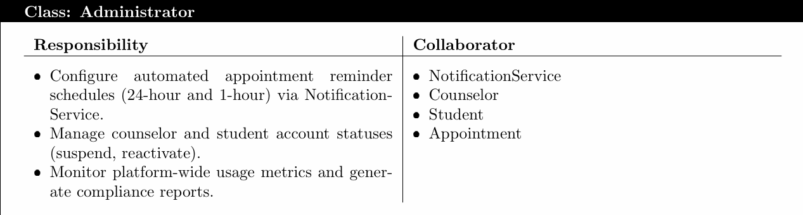
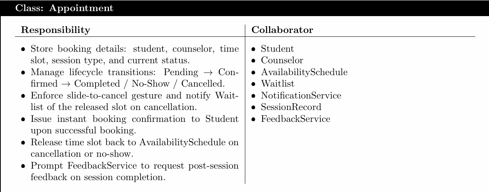
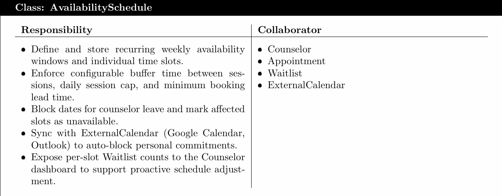
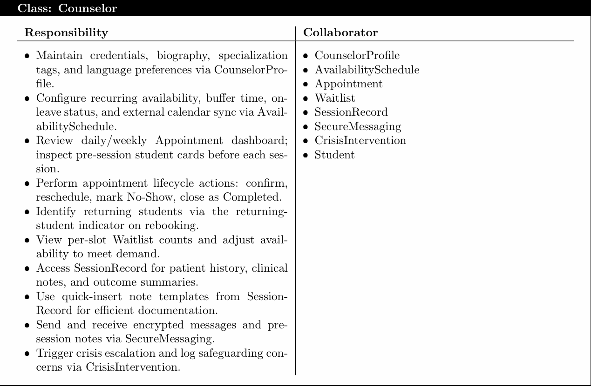
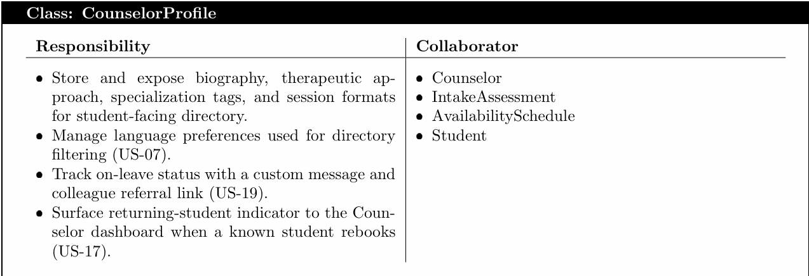
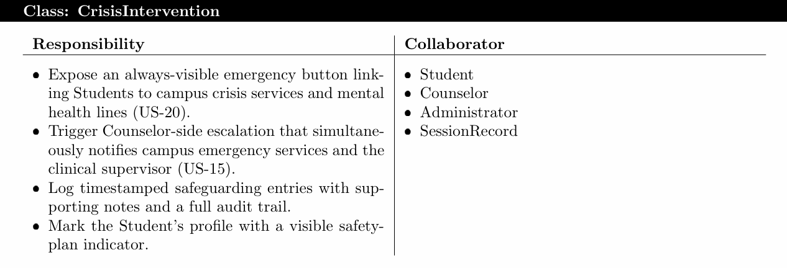
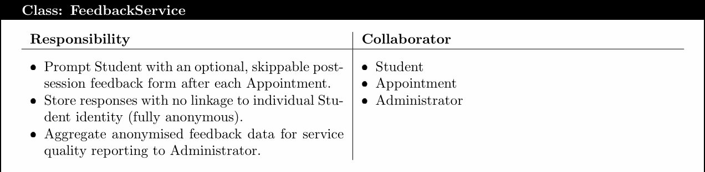
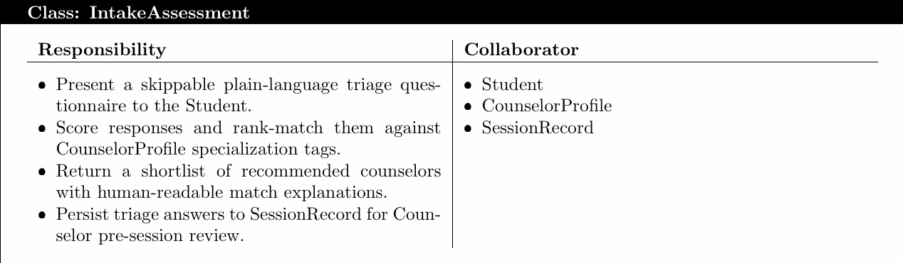
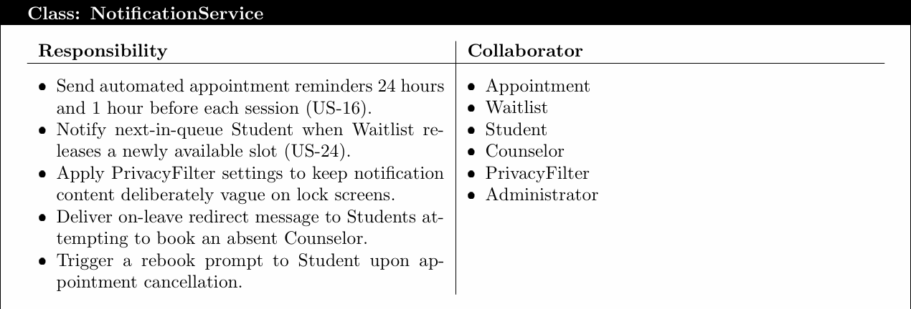
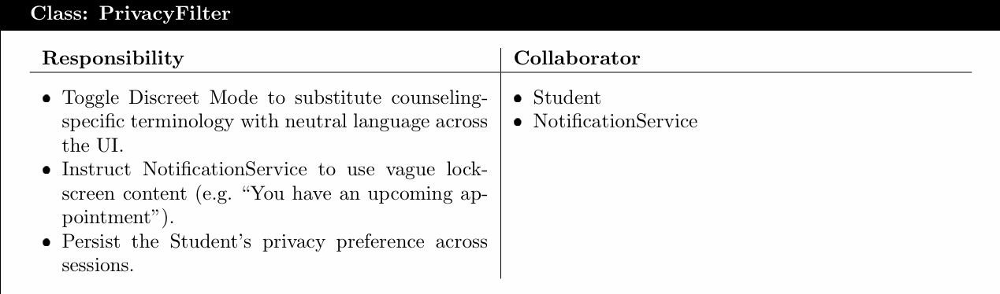
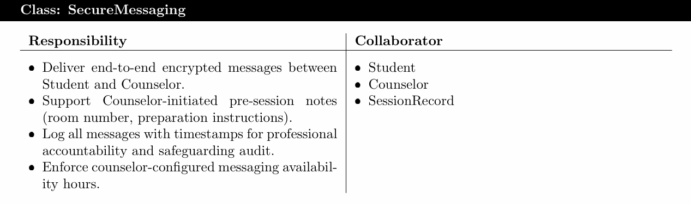
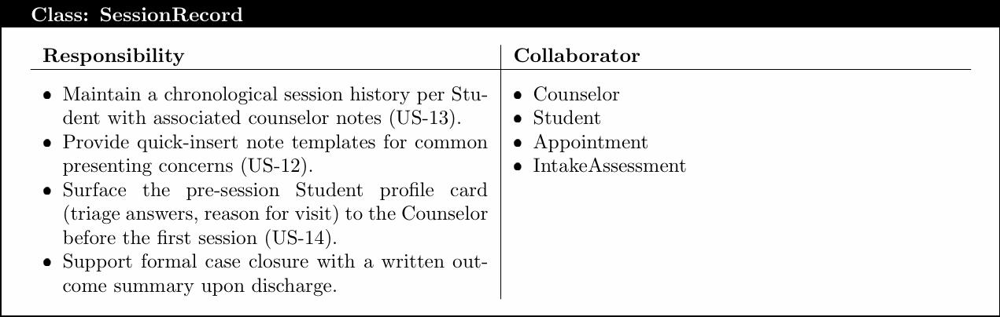
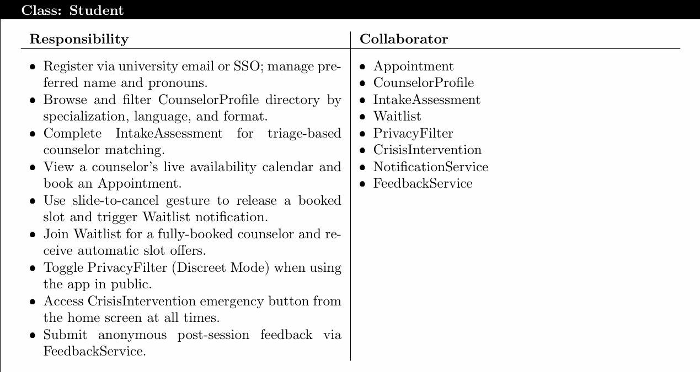
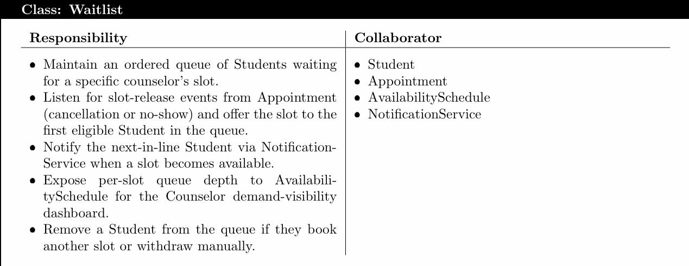
---

## User Interface Mockups & Wireframes

### UI Screens & Storyboards – Project Part 2
*Diagrams of the main user interface layout, major dialogs, and storyboard sequences showing transitions based on user input.*

**Login Screen**

*Description: User login details*

**Main Application Screen**

**Feedback Form**

**Matching Quiz**

**Counselor's Screen**

*Description: Counselor navigates the meetings scheduled with the students.*

**Admin's Screens**
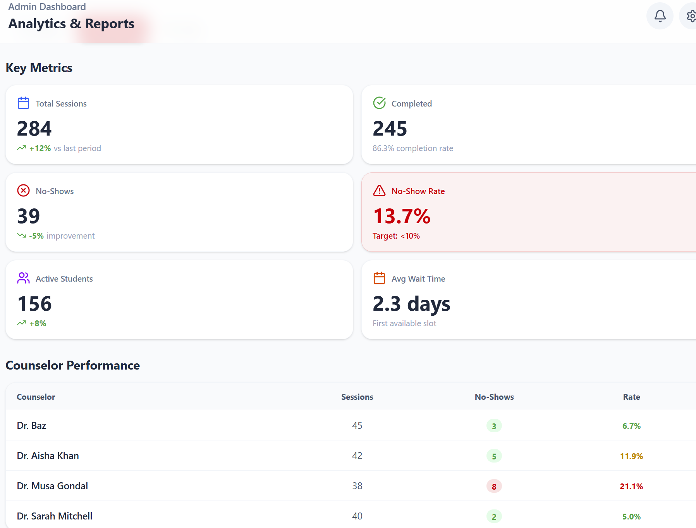
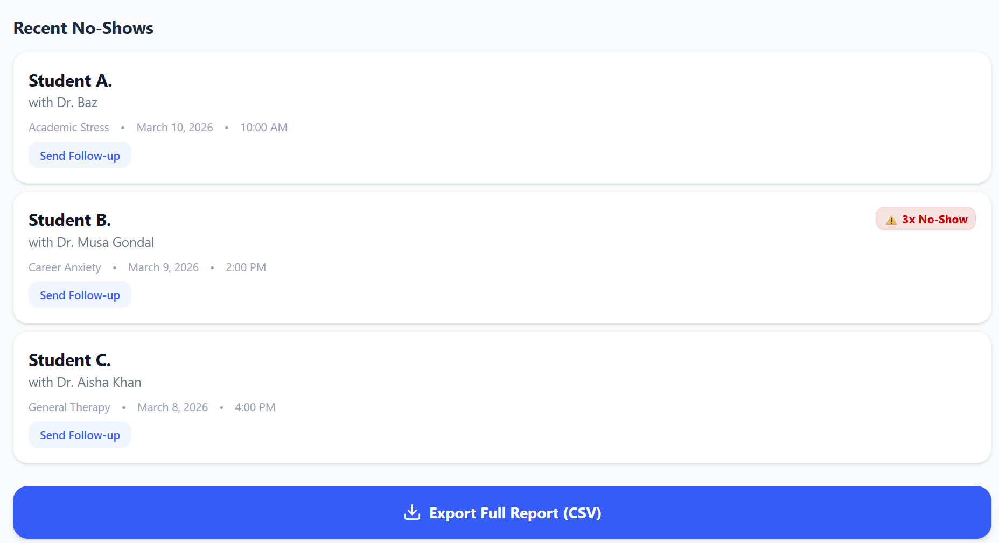

**Admin's Screens**

---

## UML Diagrams
*Not implemented yet*
